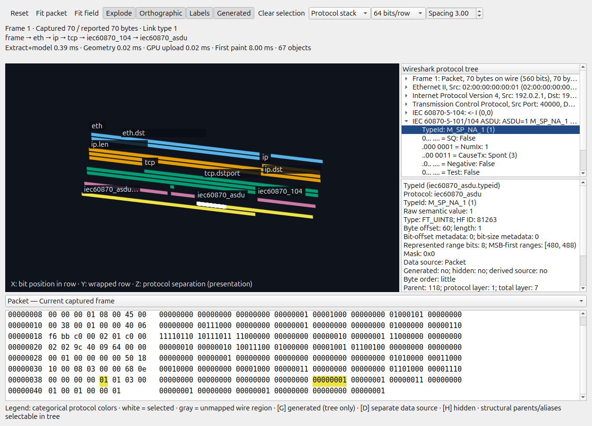

# 3DPacketViewer

Native Qt/OpenGL visualization of the currently selected Wireshark packet.
The viewer copies Wireshark's protocol tree and data sources, resolves their
reported byte and bit ranges, and displays an interactive protocol stack or
wrapped field layout. It does not parse protocols independently.

Target: **Wireshark 4.7.4 development**, commit
`9fc76ca769c9226b3d484cc43e5b62289fab1da3`. This is a source-integrated UI
plugin for this pinned revision, not a binary for distribution Wireshark 4.2.
See [compatibility](docs/WIRESHARK_COMPATIBILITY.md) and the executed
[version gate](docs/VERSION_GATE.md).



Build requirements: C++20 compiler, CMake >=3.22 (upstream requirements also
apply), Ninja, Python 3, Qt 6 including Widgets/OpenGL/OpenGLWidgets, and
Wireshark's native development dependencies. On Linux:

```sh
python3 tools/build.py --wireshark ../wireshark-pinned --build ../ws-build --jobs 4
../ws-build/run/wireshark
```

Open **Tools → 3DPacketViewer → Open 3D packet viewer**. Select a packet in
Wireshark; the viewer updates automatically. The window is modeless and owned
by Wireshark. For installation, use the corresponding Wireshark build's
`cmake --install` operation; the module installs into the versioned `ui`
plugin directory. Do not copy it into an unrelated Wireshark installation.
Detailed dependency, installation, Windows and macOS instructions are in
[BUILD.md](docs/BUILD.md).

| Input | Action |
|---|---|
| Left drag | Orbit freely |
| Wheel | Zoom |
| Middle/right drag | Pan |
| Double click | Fit selected canonical field, otherwise whole scene |
| R / F | Reset camera / fit packet |
| E / O | Explode layers / orthographic projection |
| L / G | Labels / generated-field tree entries |
| Escape | Clear field selection |

The toolbar also provides these actions, field fitting, mode selection,
32/64/128-bit row widths, and layer spacing. Click a field or a protocol-tree
entry for metadata. Hover a rendered field for metadata. The raw view shows
hex and MSB-first binary values, highlighting the selected range in its own
data source. Selecting a field in native Packet Details updates the plugin;
reverse selection into native Packet Details is not exposed by the plugin API.

**Interpretation:** X is bit position within a wrapped row; Y identifies the
row. One unit of planar width is one bit. Row gaps, shallow thickness, camera,
colors and Z layer separation are presentational. Volume is not a packet
quantity. Later protocol interpretations take canonical precedence, then deeper
tree fields and earlier tree order; overlapping interpretations remain
selectable in the tree. Generated fields occupy no wire-layout positions.
Uncovered bits are “Unmapped wire region,” not presumed payload. Additional
data sources appear separately and are never presented as original-frame bytes.
See [scientific validity](docs/SCIENTIFIC_VALIDITY.md) for precision limits.

Generic support follows Wireshark's dissectors. Synthetic validation covers
Ethernet, IPv4/IPv6, TCP/UDP, ARP, ICMP, VLAN, options, truncation, malformed
frames, TCP/IP reassembly, Modbus/TCP, IEC 60870-5-104, GOOSE, MMS, Sampled
Values and DNP3 link headers. These are bounded fixture claims, not exhaustive
protocol certifications. See [protocol support](docs/PROTOCOL_SUPPORT.md).

```sh
# Independent core/UI build and core tests
cmake -S . -B build -G Ninja
cmake --build build
ctest --test-dir build --output-on-failure
# Wireshark-backed fixture validation
python3 tools/make_fixtures.py
python3 tests/integration/validate.py --bin ../ws-build/run \
  --fixtures build-fixtures --output build-validation
```

[Validation results](docs/VALIDATION.md) · [Architecture](docs/ARCHITECTURE.md) ·
[Limitations](docs/LIMITATIONS.md). GPL-2.0-or-later. All packet processing
is local: no telemetry, remote renderer, network client, or external parser is
part of the plugin.
