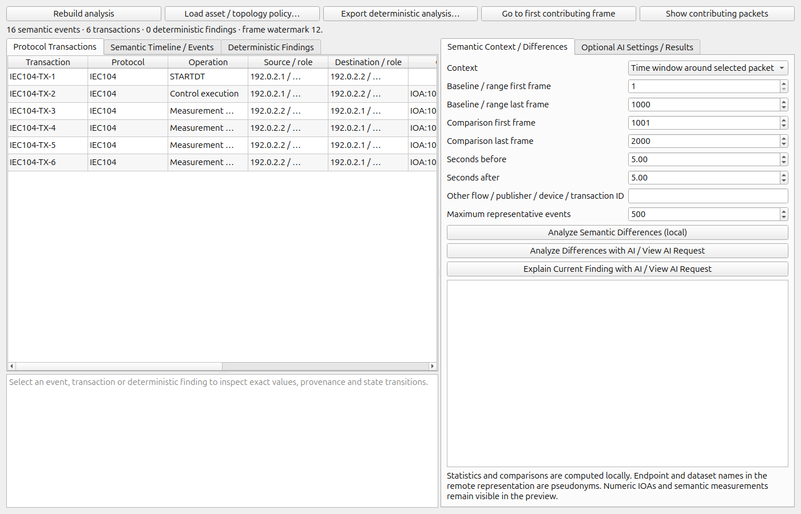

# Stateful Semantic Protocol Analyzer

A native Wireshark extension for offline transaction reconstruction, publisher-state observations and cross-packet semantic differences. Wireshark supplies decoded fields; deterministic C++ modules correlate them. Optional AI receives a reviewed, allowlisted semantic summary and cannot alter protocol results.

The native module is independent of 3DPacketViewer. It shares this repository's pinned Wireshark build. **Target: Wireshark 4.7.4 development, commit `9fc76ca769c9226b3d484cc43e5b62289fab1da3`. It is not compatible with the installed distribution Wireshark 4.2.2.**

Open **Tools → Stateful Semantic Protocol Analyzer → Protocol Transactions**. Opening the analyzer performs one Wireshark retap of an already open capture. Subsequent packet events update state. Closing the analyzer unregisters its tap and releases full-tree mode.



The transaction table shows operation, endpoints/roles, object, observed state, completion and duration. Select a row for its contributing frames and explicit state transitions. Double-click an event to navigate to its Wireshark frame; **Show contributing packets** applies a frame-number filter. Semantic Timeline is an ordered event table, not a quantitative 3D display.

Select **Analyze Semantic Differences (local)** for locally computed statistics and the sanitized representation. Contexts include findings, multiple transactions, selected packets/events, conversations, publishers, protocols, devices, time windows, ranges and capture summaries. Comparison modes accept another range or an exact local entity ID. Numeric comparisons align only identical measurement identities; different devices/streams are summarized independently rather than silently equated.

AI is unchecked on every new viewer. Configure `OPENCODE_API_KEY` before launching, or enter a session key in the masked field. Keys are never saved in application settings. Enable AI, **Refresh Models**, choose a currently discovered model, then choose an analysis action. **View AI Request** shows the exact JSON body. Only **Send** transmits it. Disabling AI cancels outstanding requests and prevents model discovery as well as analysis requests. Test Connection checks TLS/catalog access; an authenticated analysis establishes key validity.

OpenCode Go is documented primarily for coding-agent traffic; service acceptance of this semantic-analysis client is not guaranteed. The plugin identifies itself truthfully. Model availability and provider retention policies can change. Read the current [official Go documentation](https://opencode.ai/docs/go/) before using remote analysis with sensitive data.

Build and test:

```sh
# Independent core, serialization, provider and privacy tests
cmake -S semantic -B build-semantic -G Ninja -DCMAKE_BUILD_TYPE=Debug
cmake --build build-semantic
ctest --test-dir build-semantic --output-on-failure

# Full pinned native build; see repository docs/BUILD.md for dependencies
python3 tools/build.py --wireshark /path/to/wireshark --build /path/to/ws-build --jobs 4 --gui-tests
cmake -S /path/to/wireshark -B /path/to/ws-build -DSSPA_GUI_TESTS=ON
cmake --build /path/to/ws-build --target semantic_analyzer semantic_analyze semantic_core_tests semantic_network_tests
python3 semantic/tools/make_fixtures.py
python3 semantic/tests/integration/validate.py --analyzer /path/to/ws-build/run/semantic_analyze --tshark /path/to/ws-build/run/tshark --fixtures build-semantic-fixtures --output build-semantic-validation
python3 semantic/tools/run_gui.py --wireshark /path/to/ws-build/run/wireshark --fixtures build-semantic-fixtures --output build-semantic-gui
```

`semantic_analyze capture.pcap report.json [policy.json]` provides a deterministic headless export. It links EPAN and Qt Core, not Qt Network. Reports remain local and contain endpoint identities; handle them as sensitive analysis artifacts. AI exports are separate and explicitly classified.

See [architecture](docs/ARCHITECTURE.md), [protocol rules and limitations](docs/PROTOCOLS.md), [configuration and contexts](docs/CONFIGURATION.md), [privacy and AI contract](docs/PRIVACY.md), [build/platforms](docs/BUILD.md), and [executed validation](docs/VALIDATION.md). This is a bounded observation engine, not protocol certification or an autonomous attack detector. GPL-2.0-or-later, consistent with Wireshark linkage; see the repository LICENSE.
